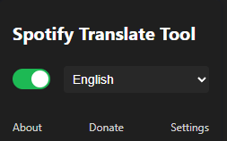
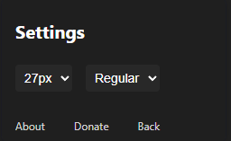

#  Spotify Lyrics Translate — Chrome Extension

**Spotify Lyrics Translate** is a Chrome extension that automatically translates song lyrics on Spotify using Google Translate, helping you understand your favorite music in your preferred language.

---

## Features

- **Real-time translation** of Spotify lyrics using Google Translate
- **Customizable text styles** (font size, italic, bold)
- **Auto-update** translations when songs change
- **(SOON) Works in Spotify fullscreen mode**
- **User settings are saved automatically**

---

## Screenshots
# 
# 

## ⚙️ Installation

1. Clone or download the repository:

   ```bash
   git clone https://github.com/I1Kuz/spotify-lyrics-translate-extesion.git

2. Open chrome://extensions/ in your Chromium-based browser

3. Enable Developer mode (top right)

4. Click "Load unpacked"

5. Select the project folder